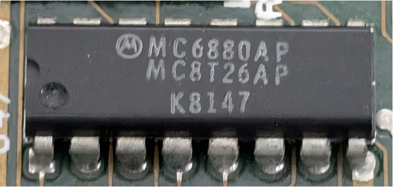

:orphan:

.. _MC6880AP:

.. #Metadata {'Product':'MC6880AP','Name':'MC6880AP Quad Three-State Bus Transceiver','Storage': 'M68MM04A'}

MC6880AP Quad Three-State Bus Transceiver
=========================================

.. rubric:: Specific Information

.. csv-table:: 
   :widths: auto

   "Date Code","8147"
   "Manufacture Date","16-NOV-1981 to 22-NOV-1981"
   "Mask","K"
   "Packaging","Plastic"
   "Status","Production"
   "Location",":ref:`M68MM04A Micromodule <Components_attached_to_the_M68MM04A_Micromodule_Components_attached_to_the_M68MM04A_Micromodule>`"
   "Temperature","0-70\ :sup:`o`\ C"
   "Frequency","1 Mhz"
   "Notes",""

.. rubric:: Collection Information

.. csv-table:: 
   :header: "Acquired"
   :widths: auto

   |present| 17-NOV-2025

.. rubric:: Links

:download:`MC6880A Quad Three-State Bus Transceiver  <../../../../_static/Documents/Datasheets/MC6880A.pdf>`