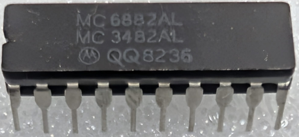

:orphan:

.. _MC6882AL:

.. #Metadata {'Product':'MC6882AL','Name':'MC6882AL Octal Three-State Buffer/Latch','Storage': 'Storage Box 2','Drawer':4,'Row':1,'Column':3}

MC6882AL Octal Three-State Buffer/Latch
=======================================

.. note::

   This is the inverting version of this product

.. rubric:: Specific Information

.. csv-table:: 
   :widths: auto

   "Date Code",""
   "Manufacture Date","30-AUG-1982 to 05-SEP-1982"
   "Mask","QQ"
   "Packaging","Ceramic"
   "Status","Production"
   "Location",":ref:`Storage Box 2, Drawer 4, Row 1, Column 3 <Storage_Box_2_Drawer_4>`"
   "Temperature","0-75\ :sup:`o`\ C"
   "Frequency",""
   "Notes",""

.. rubric:: Collection Information

.. csv-table:: 
   :header: "Acquired"
   :widths: auto

   |present| 08-APR-2026

.. rubric:: Links

:download:`MC6882 Octal Three-State Buffer/Latch  <../../../../_static/Documents/Datasheets/DS-MC6882.pdf>`