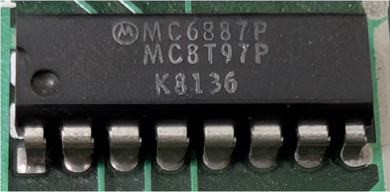

:orphan:

.. _MC6887P:

.. #Metadata {'Product':'MC6887P','Name':'MC6887P Hex Three-State Buffer/Inverter','Storage': 'M68MM12'}

MC6887P Hex Three-State Buffer/Inverter
=======================================

.. rubric:: Specific Information

.. csv-table:: 
   :widths: auto

   "Date Code","8136"
   "Manufacture Date","31-AUG-1981 to 06-SEP-1981"
   "Mask","K"
   "Packaging","Plastic"
   "Status","Production"
   "Location",":ref:`M68MM12 Micromodule <Components_attached_to_the_M68MM12_Micromodule_Components_attached_to_the_M68MM12_Micromodule>`"
   "Temperature","0-70\ :sup:`o`\ C"
   "Frequency","1 Mhz"
   "Notes",""

.. rubric:: Collection Information

.. csv-table:: 
   :header: "Acquired"
   :widths: auto

   |present| 17-NOV-2025

.. rubric:: Links

:download:`MC6887 Hex Three-State Buffer/Inverter  <../../../../_static/Documents/Datasheets/MC6885-88.pdf>`