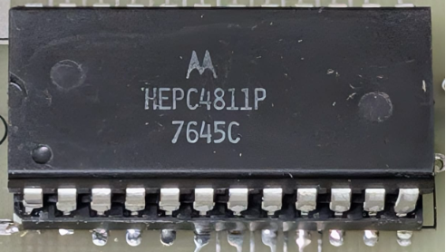

:orphan:

.. _HEPC4811P:

.. #Metadata {'Product':'HEPC4811P','Name':'HEPC4811P 128 x 8-bit RAM','Storage': 'EDUCATORII'}

HEPC4811P 128 x 8-bit RAM
=========================

.. rubric:: Specific Information

.. csv-table:: 
   :widths: auto

   "Date Code","7645C"
   "Manufacture Date","01-NOV-1976 to 07-NOV-1976"
   "Mask",""
   "Packaging","Plastic"
   "Status","Production"
   "Location",":ref:`EDUCATORII <Educator_II_Microcomputer_Kit_Educator_II_Microcomputer_Kit>`"
   "Temperature",""
   "Frequency",""
   "Notes",""

.. rubric:: Collection Information

.. csv-table:: 
   :header: "Acquired"
   :widths: auto

   |present| 14-JAN-2026

.. rubric:: Links

:download:`MC6810 DataSheet <../../../../_static/Documents/Datasheets/MCM6810.pdf>`

:download:`MC6810 DataSheet (1981 edition) <../../../../_static/Documents/Datasheets/MCM6810.2.pdf>`
