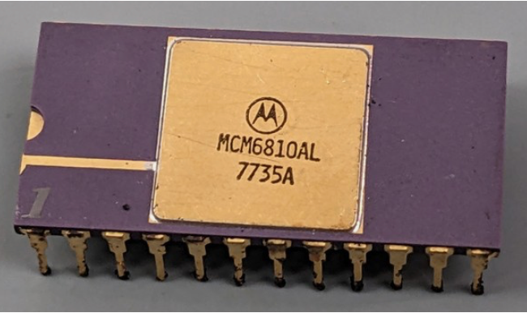

:orphan:

.. _MCM6810AL:

.. #Metadata {'Product':'MCM6810L','Name':'MCM6810L 128 x 8-bit RAM','Storage': 'S','Drawer':0,'Row':0,'Column':0}

MCM6810AL 128 x 8-bit RAM
========================

.. rubric:: Specific Information

.. csv-table:: 
   :widths: auto

   "Date Code","TBD"
   "Manufacture Date","TBD"
   "Mask",""
   "Packaging","Ceramic"
   "Status","Production"
   "Location","TBD"
   "Temperature","0-70\ :sup:`o`\ C"
   "Frequency",""
   "Notes",""

.. rubric:: Collection Information

.. csv-table:: 
   :header: "Acquired"
   :widths: auto

   |notpresent|

.. rubric:: Links

:download:`MC6810 DataSheet <../../../../_static/Documents/Datasheets/MCM6810.pdf>`

:download:`MC6810 DataSheet (1981 edition) <../../../../_static/Documents/Datasheets/MCM6810.2.pdf>`
