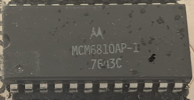

:orphan:

.. _MCM6810AP-1:

.. #Metadata {'Product':'MCM6810AP-1','Name':'MCM6810AP-1 128 x 8-bit RAM','Storage': 'Storage Box 3','Drawer':4,'Row':1,'Column':1}

MCM6810AP-1 128 x 8-bit RAM
===========================

.. rubric:: Specific Information

.. csv-table:: 
   :widths: auto

   "Date Code","7643"
   "Manufacture Date","18-OCT-1976 to 24-OCT-1976"
   "Mask",""
   "Packaging","Plastic"
   "Status","Production"
   "Location",":ref:`Storage Box 3, Drawer 4, Row 1, Column 1 <Storage_Box_3_Drawer_4>`"
   "Temperature","0-70\ :sup:`o`\ C"
   "Frequency","1MHz"
   "Notes","New in box (unopened)"

.. rubric:: Collection Information

.. csv-table:: 
   :header: "Acquired"
   :widths: auto

   |present| 11-JUL-2026

.. rubric:: Links

:download:`MC6810 DataSheet <../../../../_static/Documents/Datasheets/MCM6810.pdf>`

:download:`MC6810 DataSheet (1981 edition) <../../../../_static/Documents/Datasheets/MCM6810.2.pdf>`
