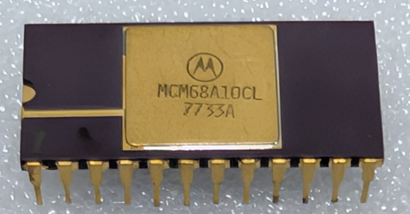

:orphan:

.. _MCM68A10CL:

.. #Metadata {'Product':'MCM68A10CL','Name':'MCM68A10CL 128 x 8-Bit Static Random Access Memory (MCM6810)','Storage': 'Storage Box 1','Drawer':4,'Row':2,'Column':6}

MCM68A10CL 128 x 8-Bit Static Random Access Memory (MCM6810)
============================================================

.. rubric:: Specific Information

.. csv-table:: 
   :widths: auto

   "Date Code","7733"
   "Manufacture Date","08-AUG-1977 to 14-AUG-1977"
   "Mask","A"
   "Packaging","Ceramic"
   "Status","Production"
   "Location",":ref:`Storage Box 1, Drawer 4, Row 2, Column 6 <Storage_Box_1_Drawer_4>`"
   "Temperature","-40-85\ :sup:`o`\ C"
   "Frequency","1.5MHz"
   "Notes",""

.. rubric:: Collection Information

.. csv-table:: 
   :header: "Acquired"
   :widths: auto

   |present| 28-OCT-2025

.. rubric:: Links

:download:`MC6810 DataSheet <../../../../_static/Documents/Datasheets/MCM6810.pdf>`

:download:`MC6810 DataSheet (1981 edition) <../../../../_static/Documents/Datasheets/MCM6810.2.pdf>`
