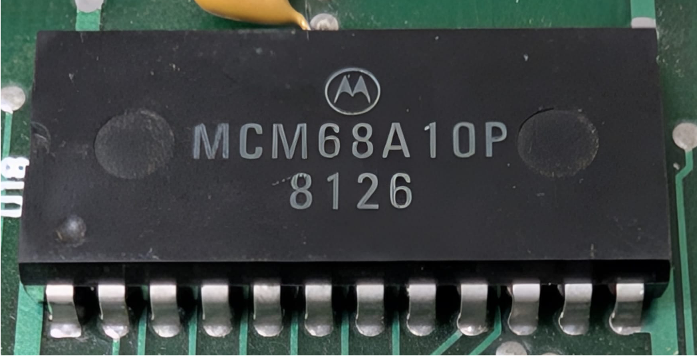

:orphan:

.. _MCM68A10P:

.. #Metadata {'Product':'MCM68A10P','Name':'MCM68A10P 128 x 8-Bit Static Random Access Memory (MCM6810)','Storage': 'M68MM12'}

MCM68A10P 128 x 8-Bit Static Random Access Memory (MCM6810)
===========================================================

.. rubric:: Specific Information

.. csv-table:: 
   :widths: auto

   "Date Code","8126"
   "Manufacture Date","22-JUN-1981 to 28-JUN-1981"
   "Mask",""
   "Packaging","Plastic"
   "Status","Production"
   "Location",":ref:`M68MM12 Micromodule <Components_attached_to_the_M68MM12_Micromodule_Components_attached_to_the_M68MM12_Micromodule>`"
   "Temperature","0-70\ :sup:`o`\ C"
   "Frequency","1.5MHz"
   "Notes",""

.. rubric:: Collection Information

.. csv-table:: 
   :header: "Acquired"
   :widths: auto

   |present| 17-NOV-2025

.. rubric:: Links

:download:`MC6810 DataSheet <../../../../_static/Documents/Datasheets/MCM6810.pdf>`

:download:`MC6810 DataSheet (1981 edition) <../../../../_static/Documents/Datasheets/MCM6810.2.pdf>`
