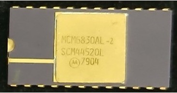

:orphan:

.. _MCM6830AL-2:

.. #Metadata {'Product':'MCM6830AL-2','Name':'MCM6830AL-2 1024 x 8-bit ROM','Storage': 'S','Drawer':0,'Row':0,'Column':0}

MCM6830AL-2 1024 x 8-bit ROM
============================

.. rubric:: Specific Information

.. csv-table:: 
   :widths: auto

   "Date Code","TBD"
   "Manufacture Date","TBD"
   "Mask",""
   "Packaging","Plastic"
   "Status","Production"
   "Location","TBD"
   "Temperature","-0-70\ :sup:`o`\ C"
   "Frequency","2.0Mhz"
   "Notes",""

.. rubric:: Collection Information

.. csv-table:: 
   :header: "Acquired"
   :widths: auto

   |notpresent| 
