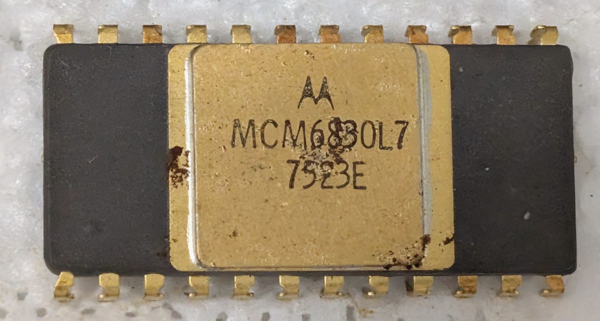

:orphan:

.. _MCM6830L7:

.. #Metadata {'Product':'MCM6830L7','Name':'MCM6830L7 1024 x 8-bit ROM containing MIKBUG/MINIBUG','Storage': 'Briefcase'}

MCM6830L7 1024 x 8-bit ROM containing MIKBUG/MINIBUG
====================================================

.. rubric:: Specific Information

.. csv-table:: 
   :widths: auto

   "Date Code","7523"
   "Manufacture Date","02-JUN-1975 to 08-JUN-1975"
   "Mask",""
   "Packaging","Ceramic"
   "Status","Production"
   "Location",":ref:`Briefcase <Briefcase_MES6800_Briefcase_MES6800>`"
   "Temperature",""
   "Frequency",""
   "Notes",""

.. rubric:: Collection Information

.. csv-table:: 
   :header: "Acquired"
   :widths: auto

   |present| 30-JAN-2025

.. rubric:: Links

:ref:`MC6830L7 Engineering Note EN-100 <EN-100>`