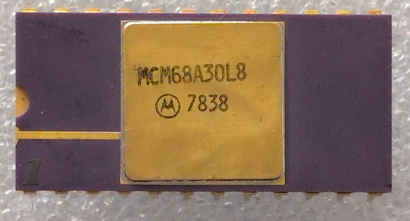

:orphan:

.. _MCM68A30L8:

.. #Metadata {'Product':'MCM68A30L8','Name':'MCM68A30L8 1024 x 8-bit ROM','Storage': 'Storage Box 1','Drawer':4,'Row':2,'Column':4}

MCM68A30L8 1024 x 8-bit ROM
===========================

.. note::

   The content has not yet been verified, but the numbering scheme suggests it is MIKBUG/MINIBUG but in a faster-clocked chip"

.. rubric:: Specific Information

.. csv-table:: 
   :widths: auto

   "Date Code","7838"
   "Manufacture Date","11-SEP-1978 to 17-SEP-1978"
   "Mask",""
   "Packaging","Ceramic"
   "Status","Production"
   "Location",":ref:`Storage Box 1, Drawer 4, Row 2, Column 4 <Storage_Box_1_Drawer_4>`"
   "Temperature","-40-85\ :sup:`o`\ C"
   "Frequency","1.5Mhz"
   "Notes",""

.. rubric:: Collection Information

.. csv-table:: 
   :header: "Acquired"
   :widths: auto

   |present| 31-MAY-2025

.. rubric:: Links

:ref:`MC6830L7 Engineering Note EN-100 <EN-100>`