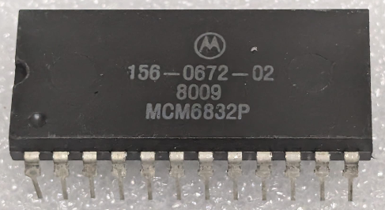

:orphan:

.. _MCM6832P:

.. #Metadata {'Product':'MCM6832P','Name':'MCM6832P 2048 x 8-bit Read Only Memory','Storage': 'Storage Box 1','Drawer':4,'Row':2,'Column':5}

MCM6832P 2048 x 8-bit Read Only Memory
======================================

.. rubric:: Specific Information

.. csv-table:: 
   :widths: auto

   "Date Code","8009"
   "Manufacture Date","25-FEB-1980 to 02-MAR-1980"
   "Mask","156-0672-02"
   "Packaging","Plastic"
   "Status","Production"
   "Location",":ref:`Storage Box 1, Drawer 4, Row 2, Column 5 <Storage_Box_1_Drawer_4>`"
   "Temperature","0-70\ :sup:`o`\ C"
   "Frequency","1 Mhz"
   "Notes",""

.. rubric:: Collection Information

.. csv-table:: 
   :header: "Acquired"
   :widths: auto

   |present| 25-OCT-2025

.. rubric:: Links

:download:`MCM6832 2048 x 8-bit Read Only Memory  <../../../../_static/Documents/Datasheets/DS-MCM6832.pdf>`