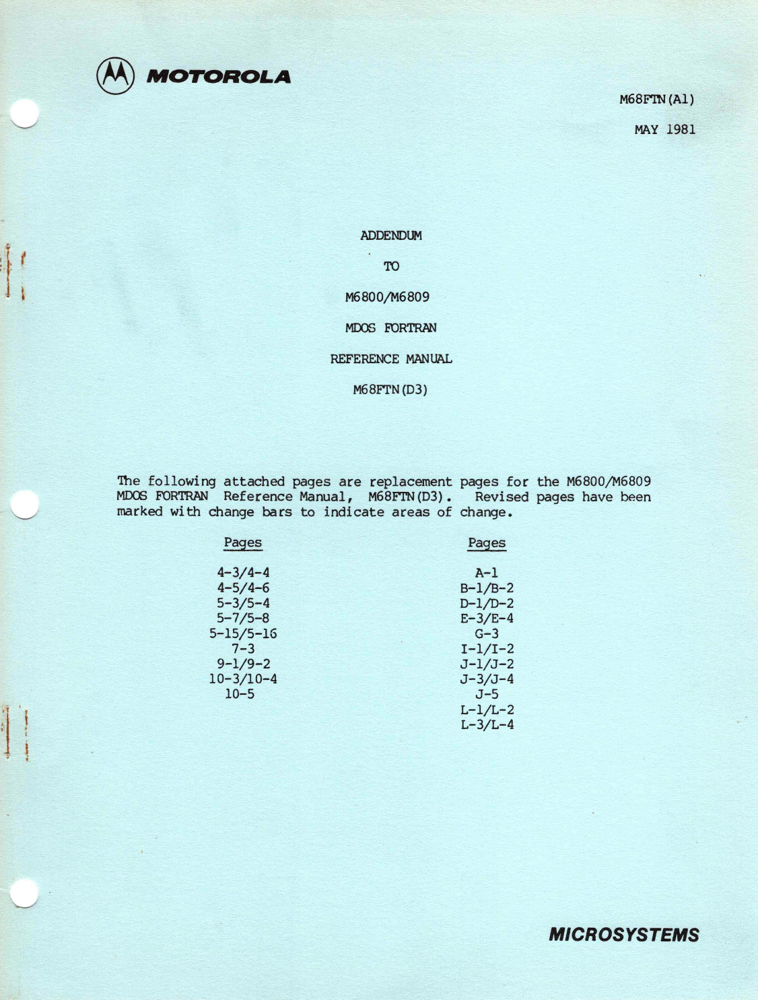

:orphan:

.. _M68FTN(A1):

.. #Metadata {'Product':'M68FTN(A1)','Name':'Addendum to M6800/M6809 MDOS FORTRAN Reference Manual M68FTN(D3)','Folder': 'None'}

Addendum to M6800/M6809 MDOS FORTRAN Reference Manual M68FTN(D3)
================================================================

.. rubric:: Collection Information

.. csv-table:: 
   :header: "Acquired"
   :widths: auto

   |notpresent|

.. rubric:: Links

:ref:`M68FTN(D3) - M6800/M6809 MDOS FORTRAN Reference Manual <M68FTN(D3)>`

:download:`Addendum to M6800/M6809 MDOS FORTRAN Reference Manual M68FTN(D3) <../../_static/Documents/Manuals/M68FTN_A1_Addendum_to_MDOS_Fortran_Reference_Manual_198105.pdf>`
