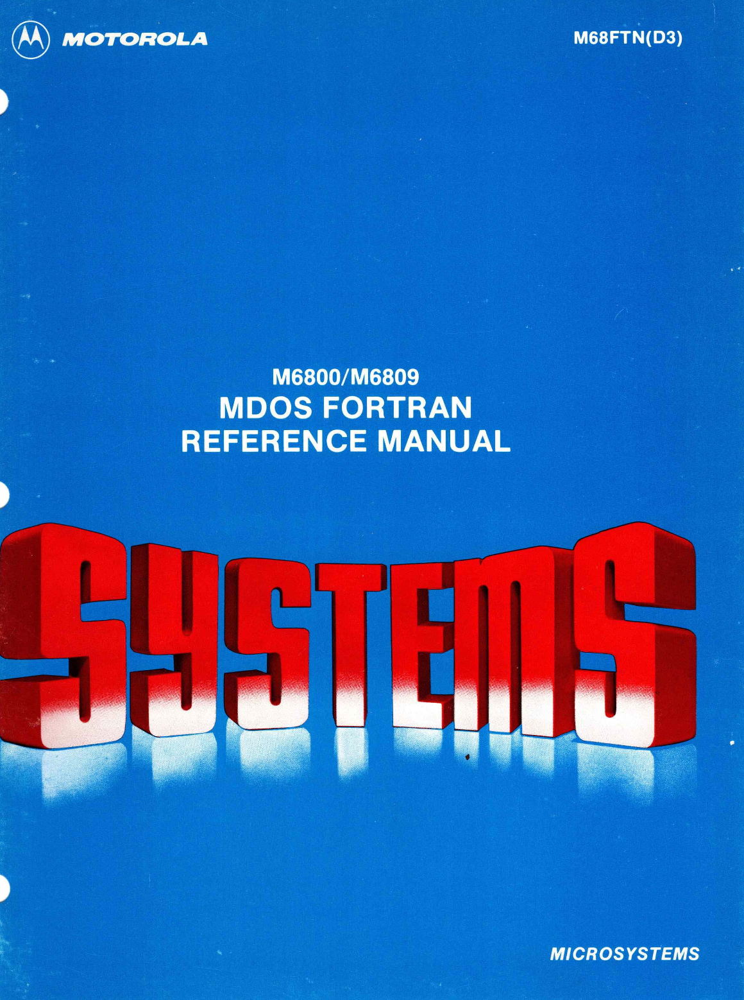

:orphan:

.. _M68FTN(D3):

.. #Metadata {'Product':'M68FTN(D3)','Name':'M6800/M6809 MDOS Fortran Reference Manual','Folder': 'None'}

M6800/M6809 MDOS Fortran Reference Manual
=========================================

.. rubric:: Collection Information

.. csv-table:: 
   :header: "Acquired"
   :widths: auto

   |notpresent|

.. rubric:: Links

:download:`M6800/M6809 MDOS Fortran Reference Manual <../../_static/Documents/Manuals/M68FTN_D3_MDOS_Fortran_Reference_Manual_198009.pdf>`

:ref:`M68FTN(A1) - Addendum to M6800/M6809 MDOS FORTRAN Reference Manual M68FTN(D3) <M68FTN(A1)>`
