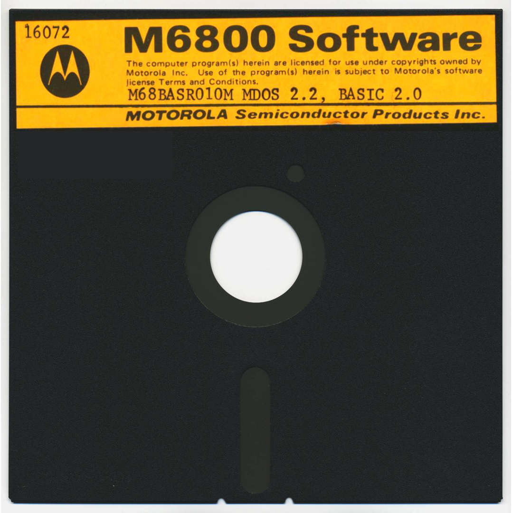

:orphan:

.. _M68BASR010M:

.. #Metadata {'Product':'M68BASR010M MDOS BASIC 2.0 on MDOS Diskette','Folder': 'LOCAL'}

M68BASR010M MDOS BASIC 2.0 MDOS Diskette
========================================

.. include:: M68BASR010M.tabs.rst

.. rubric:: Collection Information

.. csv-table:: 
   :header: "Acquired"
   :widths: auto

   |present| 21-NOV-2025

.. rubric:: Links

:download:`Disk Image File (IMD Format) <../../_static/Software/M68BASR010M/M68MASR010M_MDOS_2.2_BASIC_2.0.IMD>`
   
:download:`Extracted BASIC File <../../_static/Software/M68BASR010M/contents/basic.cm>`

:extlink-bitsavers:`M68BASR010M Disk Image <mdos_3.0/M68MASR010M_MDOS_2.2_BASIC_2.0.IMD>`
