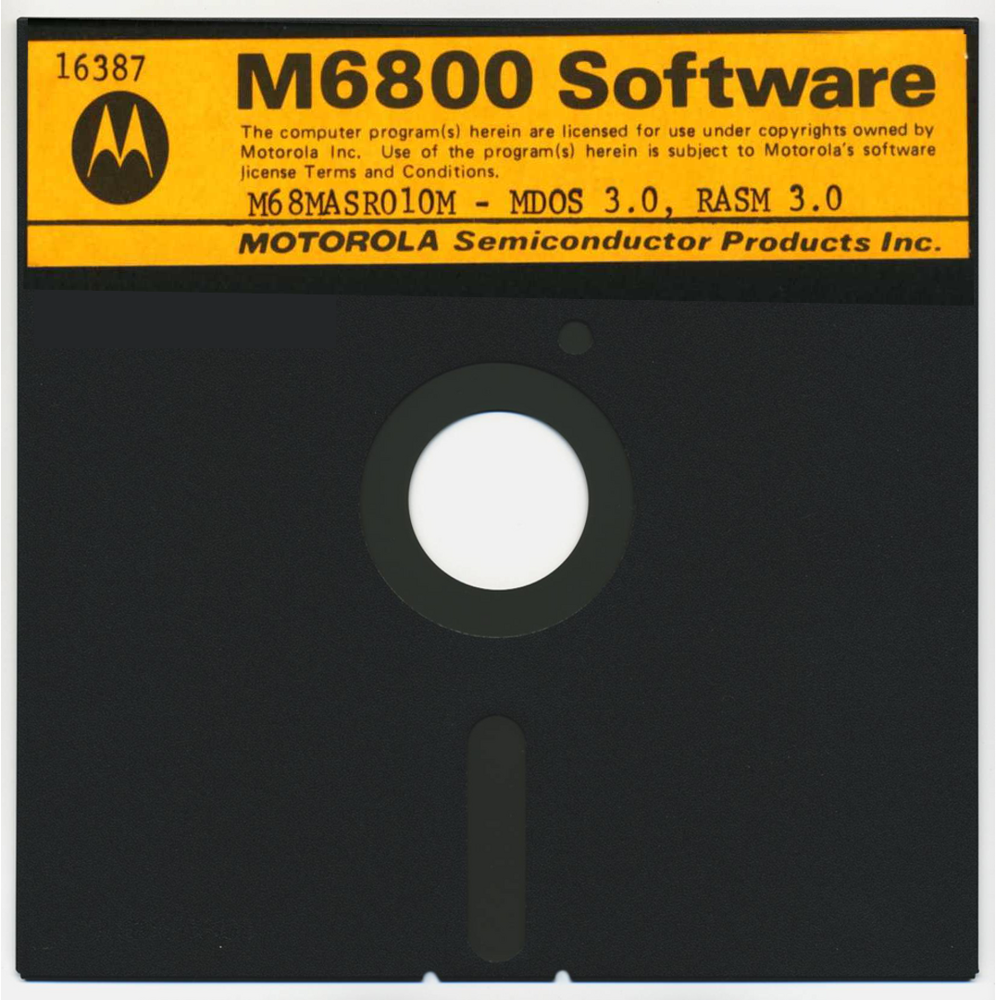
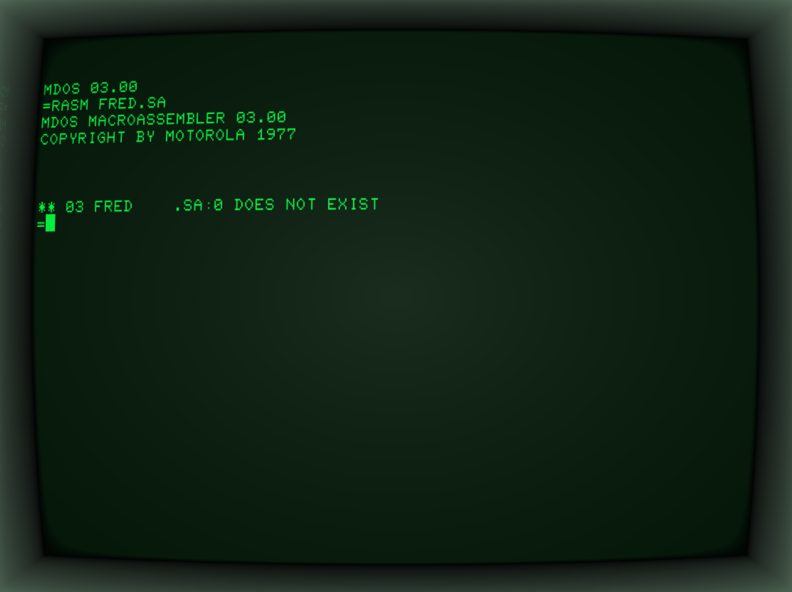

:orphan:

.. _M68MASR010M:

.. #Metadata {'Product':'M68MASR010M MDOS Macro Assembler 3.0 on MDOS Diskette','Folder': 'LOCAL'}

M68MASR010M MDOS Macro Assembler 3.0 on MDOS Diskette 
=====================================================

.. note:: 

   This is a MDOS 3.0 bootable disk.
   
   A disk image of MDOS Macro Assembler 3.0, in IMD format. 

   Sector size is 128
   Disk size is 250K

.. rubric:: Collection Information

.. csv-table:: 
   :header: "Acquired"
   :widths: auto

   |present| 27-NOV-2025

.. rubric:: Links

:download:`Disk Image File (IMD Format) <../../_static/Software/M68MASR010M/M68MASR010M_MDOS_3.0_RASM_3.0.IMD>`
   
:extlink-bitsavers:`M68MASR010M Disk Image <mdos_3.0/M68MASR010M_MDOS_3.0_RASM_3.0.IMD>`

:download:`Macro Assemblers Reference Manual <../../_static/Documents/Manuals/M68MASR_Macro_Assemblers_Reference_6800_6801_6805_6809_Sep1979.pdf>`