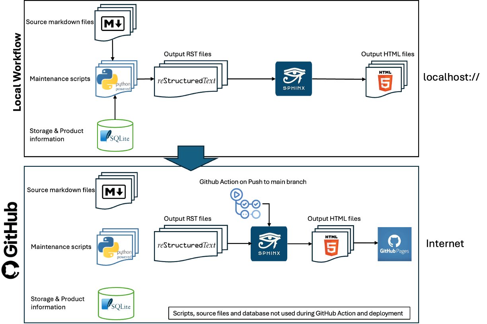

:orphan:

.. _workflow:

Technical Information
=====================

**General Background**

This site is developed and maintained using a publically available `Github`_ Repository.
All changes are viewable in the commit history.

This site is primarily served through a custom domain `mc6800.info`_ which is then redirected to a set of `GitHub Pages`_.

To understand how the site is maintained, there are several aspects to be described, and a quantity of information sources.

The main tools used in the local deployment of the site are:

**SQLite Database**

For each of the products, there is an entry in a `Sqlite`_  database held locally. 

**Python**

A set of `Python`_ scripts maintains the database through the medium of a terminal interface fronted by a set of menus. 
Note that all of the Python scripts are custom-written for this single purpose.

**Sphinx**

`Sphinx`_ is a documentation generator written and used by the Python community.

**Local Workflow**

**Stage 1**

There exist a set of static pages which are in markdown format which are manually maintained. Due to Sphinx’s ability to preprocess markdown as well as RST, this is no issue.

**Stage 2**

The Python scripts create a single RST file for each product, using data from the SQLite database, together with any links that have been created to related products or documents etc. 

Additionally, a set of tables is constructed (again as RST documents) which relate to the products present in the collection, timeline of acquisition and a map of where those products are stored in the collection (folder X, Storage Box Y etc).

Once this is done, Sphinx is called, which takes as input the whole set of RST files generated and creates a local website which can be browsed.

All of the above as described happens on a local device. 

**Remote Workflow**

Once satisfied with any changes, the whole repository’s changes are committed and pushed to the GiHub repository as a Pull Request. 

When the PR is approved and merged, a GitHub Action is invoked to call Sphinx on  the outputted RST files to produce a GitHub Pages website.

.. rubric:: Both local and GitHub Actions workflow

.. _GitHub: https://github.com/
.. _GitHub Pages: https://docs.github.com/en/pages
.. _mc6800.info: http://mc6800.info
.. _python: https://www.python.org
.. _sphinx: https://www.sphinx-doc.org/en/master/
.. _sqlite: https://sqlite.org
