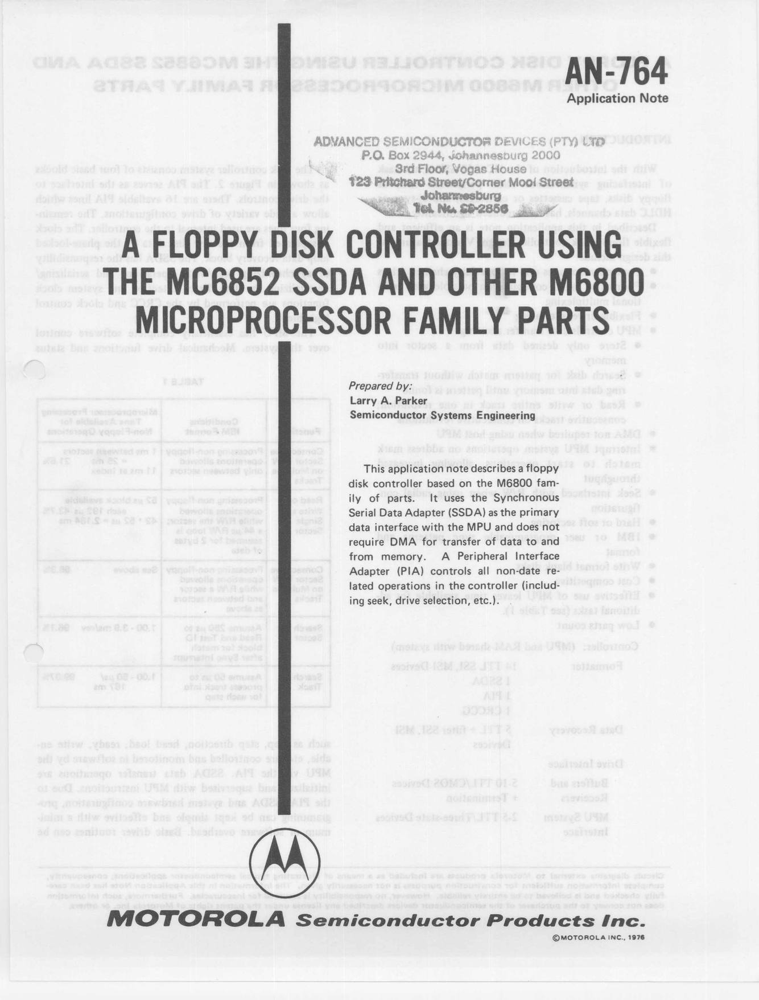

:orphan:

.. _AN-764:

A Floppy Disk Controller using the MC6582 and other MC6800 Microprocessor Family Parts
======================================================================================

.. rubric:: Collection Information

.. csv-table:: 
   :header: "Acquired"
   :widths: auto

   :material-regular:`thumb_down;2em;sd-text-danger`

.. rubric:: Links

:download:`A Floppy Disk Controller using the MC6582 and other MC6800 Microprocessor Family Parts <../../_static/Documents/ApplicationNotes/AN-764.pdf>`