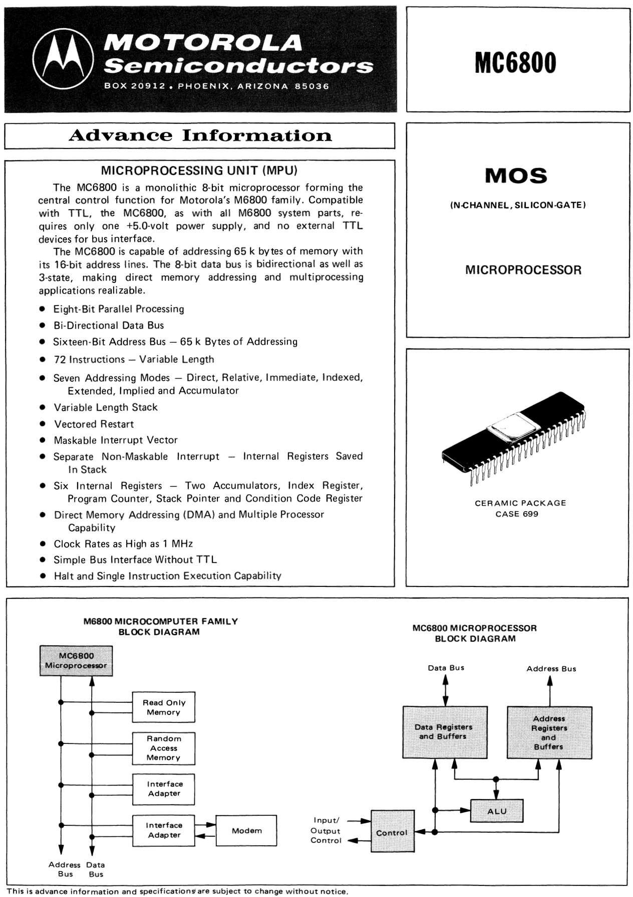

:orphan:

.. _DS-MC6800-MAY75:

.. #Metadata  {'Product':'8-Bit Microprocessing Unit (PIA) (Advance Information May 1975)','Folder': '<SYSREF>'}

8-Bit Microprocessing Unit (Advance Information May 1975)
==========================================================

.. rubric:: Collection Information

.. csv-table:: 
   :header: "Acquired"
   :widths: auto

   |document| :ref:`M6800 Systems Reference and Data Sheets <SYSREF>` 31-MAR-2025

.. rubric:: Links

:download:`Microprocessing Unit (MPU) May 1975 Advance Information <../../_static/Documents/Datasheets/MC6800-May75.pdf>`

See also:

:download:`8-Bit Microprocessing Unit <../../_static/Documents/Datasheets/MC6800.pdf>`

