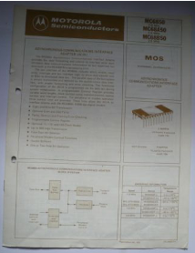

:orphan:

.. _MC6850:

MC6850 (1 Mhz)/MC68A50 (1.5 Mhz)/MC68B50 (2 Mhz) Asynchronous Communications Interface Adapter 
==============================================================================================

.. rubric:: Collection Information

.. csv-table:: 
   :header: "Component","Datasheet"
   :widths: auto

    :material-regular:`verified;2em;sd-text-success` :ref:`12-MAR-2025 <MC6850L>`,:material-regular:`verified;2em;sd-text-success` 28-MAR-2025

.. rubric:: Links

:download:`MC6850 DataSheet <../../_static/Documents/Datasheets/MC6850.pdf>`

