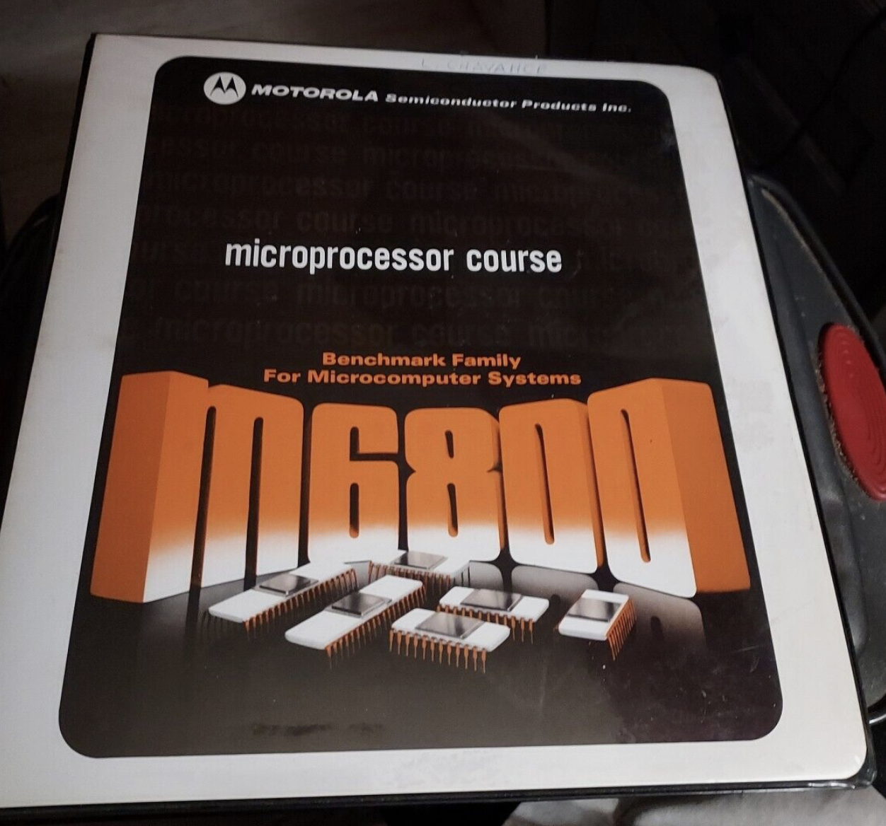
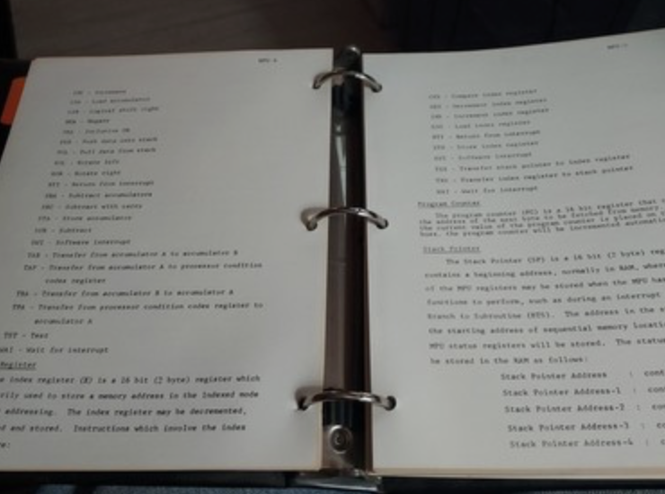

:orphan:

.. _MC6800COURSEBNDR:

Microprocessor Course
=====================

   

   
.. rubric:: Collection Information

.. csv-table:: 
   :header: "Acquired"
   :widths: auto

   :material-regular:`verified;2em;sd-text-success` 31-MAR-2025

.. rubric:: This binder contains many other documents, including:

- 6800 Microprocessor Course
- :ref:`M6800 Systems Reference and Data Sheets (May 1975 Edition) <SYSREF>`
- :ref:`M-GE`
- :ref:`M-PDP-11`
- :ref:`M-MTSS`
- :ref:`M-UCS`
- :ref:`M-EXORciser`

