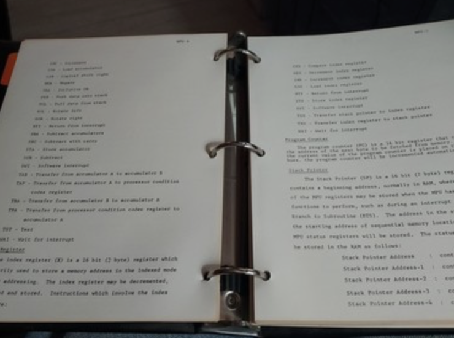

:orphan:

.. _MC6800CRSBNDR:

.. #Metadata {'Product':'Microprocessor Course','Folder': 'Microprocessor Course'}

Microprocessor Course
=====================

.. image:: ../../images/Reference/MicroprocessorCourseBinder.1.png
   :width: 400
   :align: center

.. note:: 
   
   This binder contains many other documents detailled below.

.. rubric:: Collection Information

.. csv-table:: 
   :header: "Acquired"
   :widths: auto

   |present| 31-MAR-2025

.. rubric:: Links

- :ref:`M6800CNP`

- :ref:`M6800 Systems Reference and Data Sheets (May 1975 Edition) <SYSREF>`

- :ref:`M-GE`

- :ref:`M-PDP-11`

- :ref:`M-MTSS`

- :ref:`M-UCS`

- :ref:`M-EXORcser`
