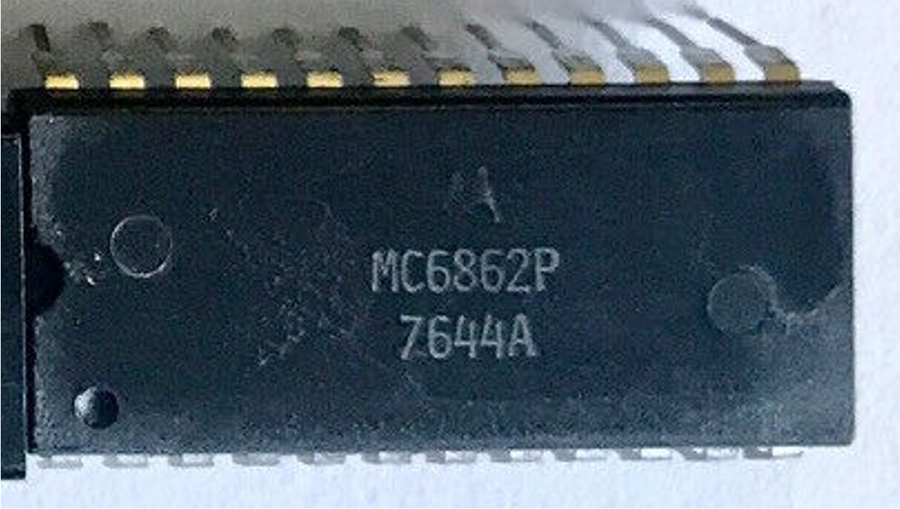

:orphan:

.. _MC6862P:

.. #Metadata {'Product':'MC6862P','Storage': 'Storage Box 1','Drawer':2,'Row':2,'Column':2}

MC6862P 2400 bps Digital Modulator
==================================

.. rubric:: Specific Information

.. csv-table:: 
   :widths: auto

   "Date Code","7644"
   "Manufacture Date","5-OCT-1976 to 31-OCT-1976"
   "Packaging","Plastic"
   "Status","Production"
   "Location","Drawer 2"
   "Notes",""

.. rubric:: Collection Information

.. csv-table:: 
   :header: "Component","Datasheet"
   :widths: auto

   :material-regular:`verified;2em;sd-text-success` 12-MAR-2025,":material-regular:`thumb_down;2em;sd-text-danger`"

