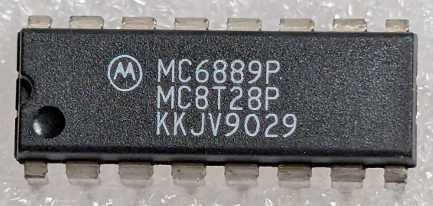

:orphan:

.. _MC6889P:
.. #Metadata {'Product':'MC6889P','Storage': 'Storage Box 1','Drawer':4,'Row':1,'Column':5}

MC6889P Quad Bus Transceiver (Non-Inverting)
============================================

.. rubric:: Specific Information

.. csv-table:: 
   :widths: auto

   "Date Code","9029"
   "Manufacture Date","09-JUL-1990 to 15-JUL-1990"
   "Packaging","Plastic"
   "Status","Production"
   "Location","Drawer 4"
   "Notes",""

.. rubric:: Collection Information

.. csv-table:: 
   :header: "Component","Datasheet"
   :widths: auto

   :material-regular:`verified;2em;sd-text-success` 30-MAY-2025",":material-regular:`thumb_down;2em;sd-text-danger`"
