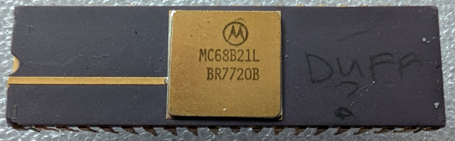

:orphan:

.. _MC68B21L:

.. #Metadata {'Product':'MC68B21L','Storage': 'Storage Box 1', 'Drawer':1,'Row':1,'Column':2}

MC68B21L Peripheral Interface Adapter
=====================================

.. rubric:: Specific Information

.. csv-table:: 
   :widths: auto

   "Date Code","BR7720"
   "Manufacture Date","09-MAY-1977 to 15-MAY-1977"
   "Packaging","Plastic"
   "Status","Production"
   "Location","Drawer 1"
   "Notes","This IC is marked as possibly defective."

This is a version of the MC6820 introduced using depletion mode technology and is fully compatible with the earlier MC6820.

.. rubric:: Collection Information

.. csv-table:: 
   :header: "Component","DataSheet"
   :widths: auto

   ":material-regular:`verified;2em;sd-text-success` 12-MAR-2025",":material-regular:`thumb_down;2em;sd-text-danger`"

.. rubric:: Links

:download:`MC6821 Datasheet <../../../_static/Documents/Datasheets/MC6821.1.pdf>`

