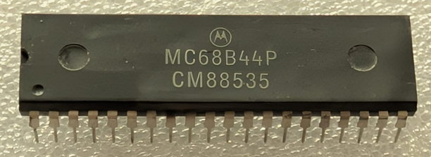

:orphan:

.. _MC68B44P:

.. #Metadata {'Product':'MC68B44P','Storage': 'Storage Box 1','Drawer':1,'Row':2,'Column':2}

MC68B44P Direct Memory Access Controller (DMAC)
===============================================

.. rubric:: Specific Information

.. csv-table:: 
   :widths: auto

   "Date Code","8853"
   "Manufacture Date","26-DEC-1988 to 01-JAN-1989"
   "Packaging","Plastic"
   "Status","Production"
   "Location","Drawer 1"
   "Notes",""
   "Frequency","TBD"
   "Temperature","TBD"
   
.. rubric:: Collection Information

.. csv-table:: 
   :header: "Component","Datasheet"
   :widths: auto

   :material-regular:`verified;2em;sd-text-success` 12-MAR-2025,":material-regular:`thumb_down;2em;sd-text-danger`"