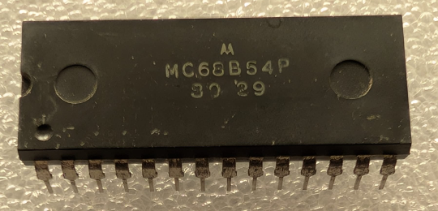

:orphan:

.. _MC68B54P:

.. #Metadata {'Product':'MC68B54P','Storage': 'Storage Box 1','Drawer':1,'Row':3,'Column':3}

MC68B54P Advanced Data Link Controller (ADLC)
============================================= 

.. rubric:: Specific Information

.. csv-table:: 
   :widths: auto

   "Date Code","8029"
   "Manufacture Date","14-JUL-1980 to 20-JUL-1980"
   "Packaging","Plastic"
   "Status","Production"
   "Location","Drawer 1"
   "Notes",""

.. rubric:: Collection Information

.. csv-table:: 
   :header: "Component","Datasheet"
   :widths: auto

   :material-regular:`verified;2em;sd-text-success` 12-MAR-2025,:material-regular:`thumb_down;2em;sd-text-danger`

