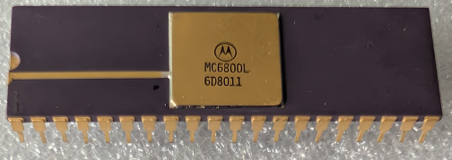

:orphan:

.. _2!MC6800L:

MC6800L Microprocessor Unit
===========================

.. #Metadata {'Product':'2!MC6800L','Name':'Microprocessor Unit','Storage': 'Storage Box 1','Drawer':3,'Row':2,'Column':3}

.. rubric:: Specific Information

.. csv-table:: 
   :widths: auto

   "Date Code","8011"
   "Manufacture Date","10-MAR-1980 to 16-MAR-1980"
   "Packaging","Ceramic"
   "Status","Production"
   "Location",":ref:`Storage Box 1, Drawer 3, Row 2, Column 3 <Storage_Box_1_Drawer_3>`"
   "Mask","6D"
   "Notes",""

.. rubric:: Collection Information

.. csv-table:: 
   :header: "Acquired"
   :widths: auto

   :material-regular:`verified;2em;sd-text-success` 09-AUG-2025

.. rubric:: Links

:download:`MC6800 DataSheet <../../../../_static/Documents/Datasheets/MC6800.pdf>`

