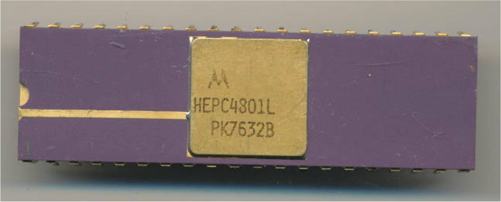

:orphan:

.. _HEPC4801L:

HEPC4801L HEP version of MC6800
===============================

.. rubric:: Specific Information

.. csv-table:: 
   :widths: auto

   "Date Code","TBD"
   "Manufacture Date","TBD"
   "Packaging","Ceramic"
   "Status","HEP"
   "Location",""
   "Notes",""

.. rubric:: Collection Information

.. csv-table:: 
   :header: "Component","Datasheet"
   :widths: auto

      ":material-regular:`thumb_down;2em;sd-text-danger`",":material-regular:`thumb_down;2em;sd-text-danger`"

