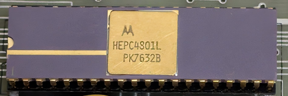

:orphan:

.. _HEPC4801L:

.. #Metadata {'Product':'HEPC4801L','Name':'HEPC4801L HEP version of MC6800','Storage': 'S','Drawer':0,'Row':0,'Column':0}

HEPC4801L HEP version of MC6800
===============================

.. rubric:: Specific Information

.. csv-table:: 
   :widths: auto

   "Date Code","TBD"
   "Manufacture Date","TBD"
   "Mask",""
   "Packaging","Ceramic"
   "Status","HEP"
   "Location","TBD"
   "Temperature",""
   "Frequency",""
   "Notes",""

.. rubric:: Collection Information

.. csv-table:: 
   :header: "Acquired"
   :widths: auto

   |notpresent|

