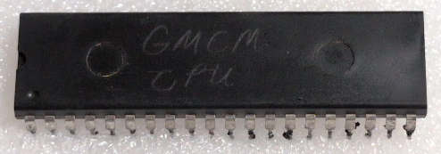

:orphan:

.. _MC6800GMCM:

.. #Metadata {'Product':'MC6800GMCM','Name':'MC6800GMCM General Motors/Delcom Microprocessor Unit','Storage': 'Storage Box 1','Drawer':2,'Row':1,'Column':2}

MC6800GMCM General Motors/Delcom Microprocessor Unit
====================================================

.. note::
   
   General Information

   The top of this IC is  pencil marked GMCM CPU. 
   These would be upwards compatible with the original 6800. 

   The GMCM was a custom microprocessor designed for General Motors by Motorola. It was used in automotive applications, specifically in engine control modules (ECMs) for vehicles. The GMCM was based on the Motorola 6800 microprocessor architecture and included enhancements to meet the specific requirements of automotive applications.

   "In 1976, Motorola had a very important customer visit: Delco Electronics. Delco had accepted the task of designing an engine control module to meet the new government regu-
   lations for emissions for all General Motors vehicles. It needed a semiconductor supplier and partner, and we won the program against stiff competition.

   The system became known as GMCM (General Motors Custom Microprocessor), and it built much of Motorola Austin. 
   Delco engineers J.D. Richardson, Phil Motz, and others, working with the Motorola design team led by Stan Groves and Gene Schriber, defined a system based on an enhanced 6800 plus a half-dozen companion chips.

   The upward-compatible enhancements to the 6800 included new 16-bit instructions, additional index register instructions, an 8x8 multiply, and faster execution cycles on key
   store and branch instructions.

   It was decreed that Motorola must have a single-chip microcontroller. The product became known as the 6801. It contained a
   128-byte RAM, 2-Kbyte ROM, sophisticated 16-bit timer (a la automotive), 4-MHz on-chip clock oscillator, programmable digital I/O, serial port and, of course, the CPU.
   Motorola originally intended to use the 6800 for the CPU, but the GMCM CPU fit the IC layout better and offered enhanced features. Motorola explained to Delco engineers that since they would likely use the 6801, it would be in Delco’s best interest to grant their request to use the GMCM CPU. Delco agreed."

.. rubric:: Specific Information

.. csv-table:: 
   :widths: auto

   "Date Code","N/A"
   "Manufacture Date","N/A"
   "Mask",""
   "Packaging","Ceramic"
   "Status","Prototype"
   "Location",":ref:`Storage Box 1, Drawer 2, Row 1, Column 2 <Storage_Box_1_Drawer_2>`"
   "Temperature","N/A"
   "Frequency","N/A"
   "Notes",""

.. rubric:: Collection Information

.. csv-table:: 
   :header: "Acquired"
   :widths: auto

   |present| 30-MAY-2025

