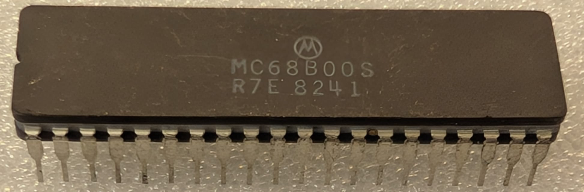

:orphan:

.. _MC68B00S:

.. #Metadata {'Product':'MC68B00S','Storage': 'Storage Box 1','Drawer':1,'Row':2,'Column':1}

MC68B00S Microprocessor Unit
============================

.. rubric:: Specific Information

.. csv-table:: 
   :widths: auto

   "Date Code","8241"
   "Manufacture Date","04-OCT-1982 to 10-OCT-1982"
   "Packaging","CERDIP"
   "Status","Production"
   "Location",":ref:`Storage Box 1, Drawer 1, Row 2, Column 1 <Storage_Box_1_Drawer_1>`"
   "Frequency","2Mhz"
   "Temperature","-0-70\ :sup:`o`\ C"
      

.. rubric:: Collection Information

.. csv-table:: 
   :header: "Acquired"
   :widths: auto

   "|present| 08-MAY-2025"

.. rubric:: Links

:download:`MC6800 DataSheet <../../../../_static/Documents/Datasheets/MC6800.pdf>`

