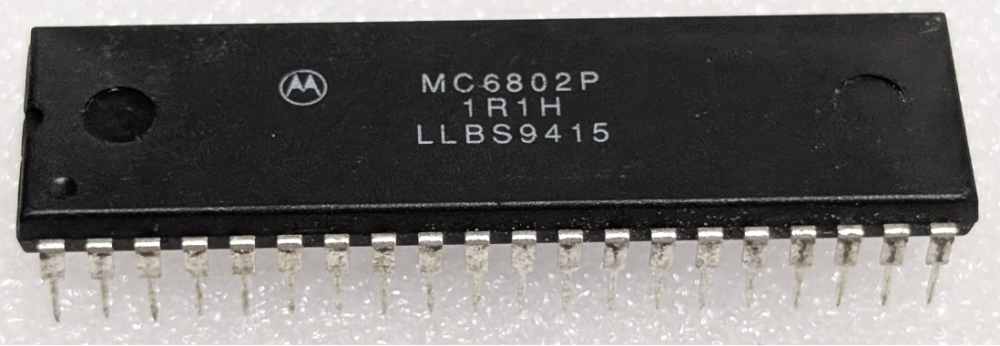

:orphan:

.. _MC6802P:

.. #Metadata {'Product':'MC6802P','Storage': 'Storage Box 2','Drawer':2,'Row':2,'Column':1}

MC6802P Microprocessor with Clock and Optional RAM (MC6802)
===========================================================

.. rubric:: Specific Information

.. csv-table:: 
   :widths: auto

   "Date Code","9415"
   "Manufacture Date","04-APR-1994 to 10-APR-1994"
   "Packaging","Plastic"
   "Status","Production"
   "Location",":ref:`Storage Box 2, Drawer 2, Row 2, Column 1 <Storage_Box_2_Drawer_2>`"
   "Temperature","0-70\ :sup:`o`\ C"
   "Mask","1R1H"
   "Frequency","1 Mhz"
   "Notes",""

.. rubric:: Collection Information

.. csv-table:: 
   :header: "Acquired"
   :widths: auto

   |present| 05-OCT-2025
   
.. rubric:: Links

:download:`MC6802 Microprocessor with Clock and Optional RAM (MC6802)  <../../../../_static/Documents/Datasheets/DS-MC6802-6808-6802NS.pdf>`
