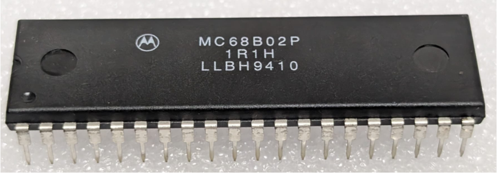

:orphan:

.. _MC68B02P:

.. #Metadata {'Product':'MC68B02P','Storage': 'Storage Box 2','Drawer':2,'Row':1,'Column':1}

MC68B02P Microprocessor with Clock and Optional RAM (MC6802)
============================================================

.. rubric:: Specific Information

.. csv-table:: 
   :widths: auto

   "Date Code","9410"
   "Manufacture Date","28-FEB-1994 to 06-MAR-1994"
   "Packaging","Plastic"
   "Status","TBD"
   "Location",":ref:`Storage Box 2, Drawer 2, Row 1, Column 1 <Storage_Box_2_Drawer_2>`"
   "Temperature","0-70\ :sup:`o`\ C"
   "Mask","1R1H"
   "Frequency","2 Mhz"
   "Notes",""

.. rubric:: Collection Information

.. csv-table:: 
   :header: "Acquired"
   :widths: auto

   |present| 05-OCT-2025

.. rubric:: Links

:download:`MC6802 Microprocessor with Clock and Optional RAM (MC6802)  <../../../../_static/Documents/Datasheets/DS-MC6802-6808-6802NS.pdf>`
