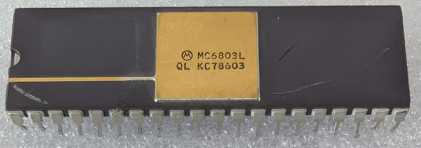

:orphan:

.. _MC6803L:

.. #Metadata {'Product':'MC6803L','Storage': 'Storage Box 2','Drawer':1,'Row':3,'Column':1}

MC6803L Microcomputer/Microprocessor +128 bytes of RAM (MCU/MPU) (MC6803)
=========================================================================

.. rubric:: Specific Information

.. csv-table:: 
   :widths: auto

   "Date Code","8603"
   "Manufacture Date","13-JAN-1986 to 19-JAN-1986"
   "Packaging","Plastic"
   "Status","Production"
   "Location",":ref:`Storage Box 2, Drawer 1, Row 3, Column 1 <Storage_Box_2_Drawer_1>`"
   "Temperature","0-70\ :sup:`o`\ C"
   "Frequency","1 Mhz"
   "Notes",""

.. rubric:: Collection Information

.. csv-table:: 
   :header: "Acquired"
   :widths: auto

   |present| 18-AUG-2025

.. rubric:: Links

:download:`MC6803 Microcomputer/Microprocessor (MCU/MPU) (MC6803)  <../../../../_static/Documents/Datasheets/MC6801-03-03NR.pdf>`
