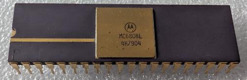

:orphan:

.. _MC6808L:

.. #Metadata {'Product':'MC6808L','Storage': 'Storage Box 2','Drawer':1,'Row':1,'Column':1}

MC6808L Microprocessor with Clock and Optional RAM (MC6808)
===========================================================

.. rubric:: Specific Information

.. csv-table:: 
   :widths: auto

   "Date Code","7904"
   "Manufacture Date","15-JAN-1979 to 21-JAN-1979"
   "Packaging","Ceramic"
   "Status","Production"
   "Location",":ref:`Storage Box 2, Drawer 1, Row 1, Column 1 <Storage_Box_2_Drawer_1>`"
   "Temperature","0-70\ :sup:`o`\ C"
   "Frequency","1 Mhz"
   "Mask","4H"
   "Notes",""

.. rubric:: Collection Information

.. csv-table:: 
   :header: "Acquired"
   :widths: auto

   |present| 09-AUG-2025

.. rubric:: Links

:download:`MC6808 Microprocessor with Clock and Optional RAM (MC6808)  <../../../../_static/Documents/Datasheets/DS-MC6802-6808-6802NS.pdf>`
