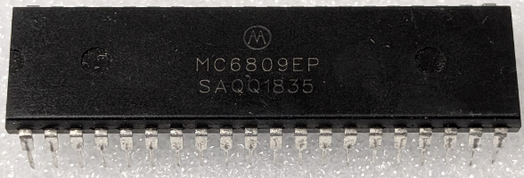

:orphan:

.. _MC6809EP:

.. #Metadata {'Product':'MC6809EP','Storage': 'Storage Box 1','Drawer':3,'Row':3,'Column':1}

MC6809EP 8-Bit Microprocessing Unit (MC6809E)
=============================================

.. rubric:: Specific Information

.. csv-table:: 
   :widths: auto

   "Date Code","Undetermined"
   "Manufacture Date","Undetermined"
   "Packaging","Plastic"
   "Status","Production"
   "Location","Drawer 3"
   "Temperature","0-70\ :sup:`o`\ C"
   "Frequency","1 Mhz"
   "Notes",""

.. rubric:: Collection Information

.. csv-table:: 
   :header: "Component","Datasheet"
   :widths: auto

   :material-regular:`verified;2em;sd-text-success` 28-MAY-2025,":material-regular:`thumb_down;2em;sd-text-danger`"

.. rubric:: Links

:download:`MC6809E 8-Bit Microprocessing Unit (MC6809E)  <../../../../_static/Documents/Datasheets/MC6809E.pdf>`
