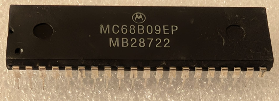

:orphan:

.. _MC68B09EP:

.. #Metadata {'Product':'MC68B09EP','Storage': 'Storage Box 1','Drawer':3,'Row':3,'Column':1}

MC68B09EP 8-Bit Microprocessing Unit (MC6809E)
==============================================

.. rubric:: Specific Information

.. csv-table:: 
   :widths: auto

   "Date Code","8722"
   "Manufacture Date","25-MAY-1987 to 31-MAY-1987"
   "Packaging","Plastic"
   "Status","Production"
   "Location",":ref:`Storage Box 1, Drawer 3, Row 3, Column 1 <Storage_Box_1_Drawer_3>`"
   "Temperature","0-70\ :sup:`o`\ C"
   "Frequency","2 Mhz"
   "Notes",""

.. rubric:: Collection Information

.. csv-table:: 
   :header: "Acquired"
   :widths: auto

   ":material-regular:`verified;2em;sd-text-success` 5-JUL-2025"

.. rubric:: Links

:download:`MC6809E 8-Bit Microprocessing Unit (MC6809E)  <../../../../_static/Documents/Datasheets/MC6809E.pdf>`
