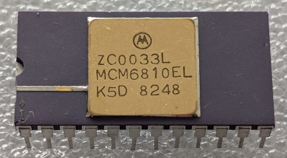

:orphan:

.. _MCM6810EL:

128 x 8-bit RAM
===============

.. rubric:: Specific Information

.. csv-table:: 
   :widths: auto

   "Date Code","8248"
   "Manufacture Date","22-NOV-1982 to 28-NOV-1982"
   "Packaging","Ceramic"
   "Status","Production"
   "Location","Drawer 2"
   "Frequency","TBD"
   "Temperature","TBD"
   "Notes",""

.. rubric:: Collection Information

.. csv-table:: 
   :header: "Component","DataSheet"
   :widths: auto

   ":material-regular:`verified;2em;sd-text-success` 29-APR-2025", :material-regular:`thumb_down;2em;sd-text-danger`"

.. rubric:: Links

:download:`MC6810 DataSheet <../../../../_static/Documents/Datasheets/MCM6810.pdf>`

