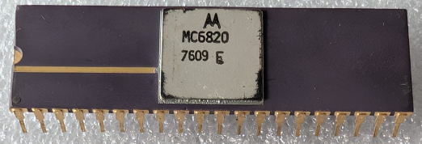

:orphan:

.. _MC6820L:

.. #Metadata {'Product':'MC6820L','Storage': 'Storage Box 2','Drawer':1,'Row':2,'Column':1}

MC6820L Peripheral Interface Adapter (PIA)
==========================================

.. rubric:: Specific Information

.. csv-table:: 
   :widths: auto

   "Date Code","7609"
   "Manufacture Date","23-FEB-1976 to 29-FEB-1976"
   "Packaging","Ceramic"
   "Status","Production"
   "Location",":ref:`Storage Box 2, Drawer 1, Row 2, Column 1 <Storage_Box_2_Drawer_1>`"
   "Temperature","0-70\ :sup:`o`\ C"
   "Frequency","1 Mhz"
   "Mask","N/A"
   "Notes","There is a mark 'F' on the IC. This may refer to a Mask Version. The IC is marked as MC6820. No packaging suffix is included."

.. rubric:: Collection Information

.. csv-table:: 
   :header: "Acquired"
   :widths: auto

   ":material-regular:`verified;2em;sd-text-success` 09-AUG-2025"
