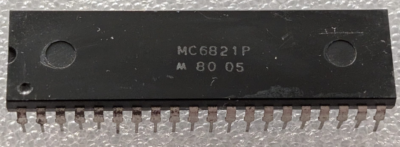

:orphan:

.. _MC6821P:

.. #Metadata {'Product':'MC6821P','Storage': 'Storage Box 1','Drawer':1,'Row':1,'Column':2}

MC6821P Peripheral Interface Adapter
====================================

.. rubric:: Specific Information

.. csv-table:: 
   :widths: auto

   "Date Code","8005"
   "Manufacture Date","28-JAN-1980 to 03-FEB-1980"
   "Packaging","Plastic"
   "Status","Production"
   "Location",":ref:`Storage Box 1, Drawer 1, Row 1, Column 2 <Storage_Box_1_Drawer_1>`"
   "Notes",""

.. rubric:: Collection Information

.. csv-table:: 
   :header: "Acquired"
   :widths: auto

   "|present| 12-MAR-2025"

