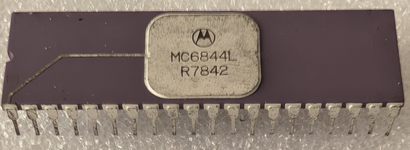

:orphan:

.. _MC6844L:

.. #Metadata {'Product':'MC6844L','Storage': 'Storage Box 1','Drawer':2,'Row':2,'Column':2}

MC6844L Direct Memory Access Controller (DMAC)
==============================================

.. rubric:: Specific Information

.. csv-table:: 
   :widths: auto

   "Date Code","7842"
   "Manufacture Date","26-SEP-1988 to 02-OCT-1988"
   "Packaging","Ceramic"
   "Status","Production"
   "Location","Drawer 2"
   "Frequency","1MHz"
   "Temperature","0-70\ :sup:`o`\ C"
   "Notes",""

.. rubric:: Collection Information

.. csv-table:: 
   :header: "Acquired"
   :widths: auto

    :material-regular:`verified;2em;sd-text-success` 7-JUL-2025