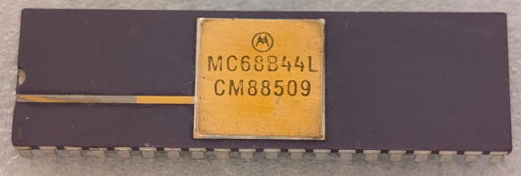

:orphan:

.. _MC68B44L:

.. #Metadata {'Product':'MC68B44L','Storage': 'Storage Box 1','Drawer':3,'Row':2,'Column':1}

MC68B44L Direct Memory Access Controller (DMAC)
===============================================

.. rubric:: Specific Information

.. csv-table:: 
   :widths: auto

   "Date Code","8509"
   "Manufacture Date","25-FEB-1985 to 03-MAR-1985"
   "Packaging","Ceramic"
   "Status","Production"
   "Location","Drawer 3"
   "Notes",""
   "Frequency","2 MHz"
   "Temperature","0-70\ :sup:`o`\ C"
   
.. rubric:: Collection Information

.. csv-table:: 
   :header: "Component","Datasheet"
   :widths: auto

   :material-regular:`verified;2em;sd-text-success` 8-MAY-2025,":material-regular:`thumb_down;2em;sd-text-danger`"