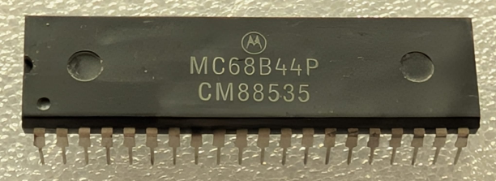

:orphan:

.. _MC68B44P:

.. #Metadata {'Product':'MC68B44P','Storage': 'Storage Box 1','Drawer':1,'Row':2,'Column':2}

MC68B44P Direct Memory Access Controller (DMAC)
===============================================

.. rubric:: Specific Information

.. csv-table:: 
   :widths: auto

   "Date Code","8853"
   "Manufacture Date","26-DEC-1988 to 01-JAN-1989"
   "Packaging","Plastic"
   "Status","Production"
   "Location",":ref:`Storage Box 1, Drawer 1, Row 2, Column 2 <Storage_Box_1_Drawer_1>`"
   "Notes",""
   "Frequency","2 MHz"
   "Temperature","0-70\ :sup:`o`\ C"
   
.. rubric:: Collection Information

.. csv-table:: 
   :header: "Acquired"
   :widths: auto

    |present| 12-MAR-2025

.. rubric:: Links

:download:`MC6844 Direct Memory Access Controller (DMAC)  <../../../../_static/Documents/Datasheets/MC6844.pdf>`
