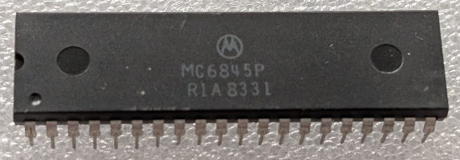

:orphan:

.. _MC6845P:

.. #Metadata {'Product':'MC6845P','Storage': 'Storage Box 1','Drawer':1,'Row':3,'Column':3}

MC6845P CRT Controller
======================

.. rubric:: Specific Information

.. csv-table:: 
   :widths: auto

   "Date Code","8331"
   "Manufacture Date","25-JUL-1983 to 31-JUL-1983"
   "Packaging","Plastic"
   "Status","Production"
   "Location",":ref:`Storage Box 1, Drawer 1, Row 3, Column 3 <Storage_Box_1_Drawer_1>`"
   "Notes",""
   "Frequency","N/A"
   "Temperature","N/A"
   
.. rubric:: Collection Information

.. csv-table:: 
   :header: "Acquired"
   :widths: auto

    |present| 12-MAR-2025

.. rubric:: Links

:download:`MC6845 CRT Controller  <../../../../_static/Documents/Datasheets/MC6845.pdf>`