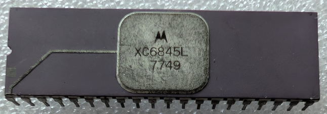

:orphan:

.. _XC6845L:

.. #Metadata {'Product':'XC6845L','Storage': 'Storage Box 1','Drawer':1,'Row':2,'Column':3}

XC6845L CRT Controller
======================

.. rubric:: Specific Information

.. csv-table:: 
   :widths: auto

   "Date Code","7749"
   "Manufacture Date","28-NOV-1977 to 04-DEC-1977"
   "Packaging","Ceramic"
   "Status","Engineering"
   "Location",":ref:`Storage Box 1, Drawer 1, Row 2, Column 3 <Storage_Box_1_Drawer_1>`"
   "Notes",""

.. rubric:: Collection Information

.. csv-table:: 
   :header: "Acquired"
   :widths: auto

   |present| 20-MAR-2025

.. rubric:: Links

:download:`MC6845 CRT Controller  <../../../../_static/Documents/Datasheets/MC6845.pdf>`
