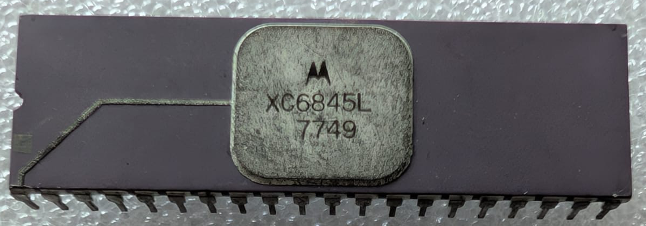

:orphan:

.. _XC6845L:

.. #Metadata {'Product':'XC6845L','Storage': 'Storage Box 1','Drawer':1,'Row':2,'Column':3}

XC6845L CRT Controller
======================

.. rubric:: Specific Information

.. csv-table:: 
   :widths: auto

   "Date Code","7749"
   "Manufacture Date","28-NOV-1977 to 04-DEC-1977"
   "Packaging","Ceramic"
   "Status","Engineering"
   "Location","Drawer 2"
   "Notes",""

.. rubric:: Collection Information

.. csv-table:: 
   :header: "Component","Datasheet"
   :widths: auto

   :material-regular:`verified;2em;sd-text-success` 20-MAR-2025,":material-regular:`thumb_down;2em;sd-text-danger`"

