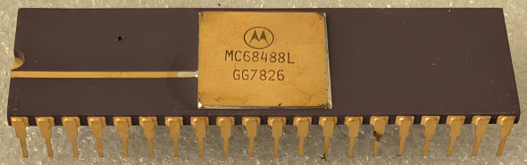

:orphan:

.. _MC68488L:

.. #Metadata {'Product':'MC68488L','Storage': 'Storage Box 1','Drawer':2,'Row':1,'Column':3}

MC68488L General Purpose Interface Adapter
==========================================

.. rubric:: Specific Information

.. csv-table:: 
   :widths: auto

   "Date Code","7826"
   "Manufacture Date","19-JUN-1978 to 25-JUN-1978"
   "Packaging","Ceramic"
   "Status","Production"
   "Location","Drawer 2"
   "Temperature","0-70\ :sup:`o`\ C"
   "Frequency","1 Mhz"
   "Notes",""

.. rubric:: Collection Information

.. csv-table:: 
   :header: "Acquired"
   :widths: auto

   :material-regular:`verified;2em;sd-text-success` 7-JUL-2025

.. rubric:: Links

:download:`MC68488 General Purpose Interface Adapter  <../../../../_static/Documents/Datasheets/MC68488.pdf>`
