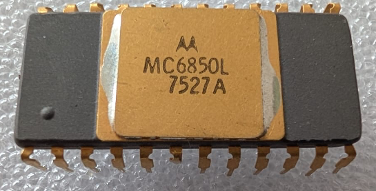

:orphan:

.. _MC6850L:
.. #Metadata {'Product':'MC6850L','Storage': 'Storage Box 1','Drawer':4,'Row':1,'Column':1}

MC6850L Asynchronous Communications Interface Adapter (MC6850)
==============================================================

.. rubric:: Specific Information

.. csv-table:: 
   :widths: auto

   "Date Code","7527"
   "Manufacture Date","30-JUN-1975 to 06-JUL-1975"
   "Packaging","Ceramic"
   "Status","Production"
   "Location","Drawer 2"
   "Notes",""

.. rubric:: Collection Information

.. csv-table:: 
   :header: "Component","Datasheet"
   :widths: auto

   :material-regular:`verified;2em;sd-text-success` 12-MAR-2025,:material-regular:`verified;2em;sd-text-success` :ref:`28-MAR-2025 <MC6850>`

