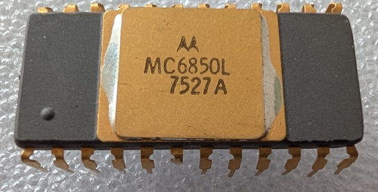

:orphan:

.. _MC6850L:
.. #Metadata {'Product':'MC6850L','Storage': 'Storage Box 1','Drawer':4,'Row':1,'Column':1}

MC6850L Asynchronous Communications Interface Adapter (MC6850)
==============================================================

.. rubric:: Specific Information

.. csv-table:: 
   :widths: auto

   "Date Code","7527"
   "Manufacture Date","30-JUN-1975 to 06-JUL-1975"
   "Packaging","Ceramic"
   "Status","Production"
   "Location",":ref:`Storage Box 1, Drawer 4, Row 1, Column 1 <Storage_Box_1_Drawer_4>`"
   "Notes",""

.. rubric:: Collection Information

.. csv-table:: 
   :header: "Acquired"
   :widths: auto

   |present| 12-MAR-2025

